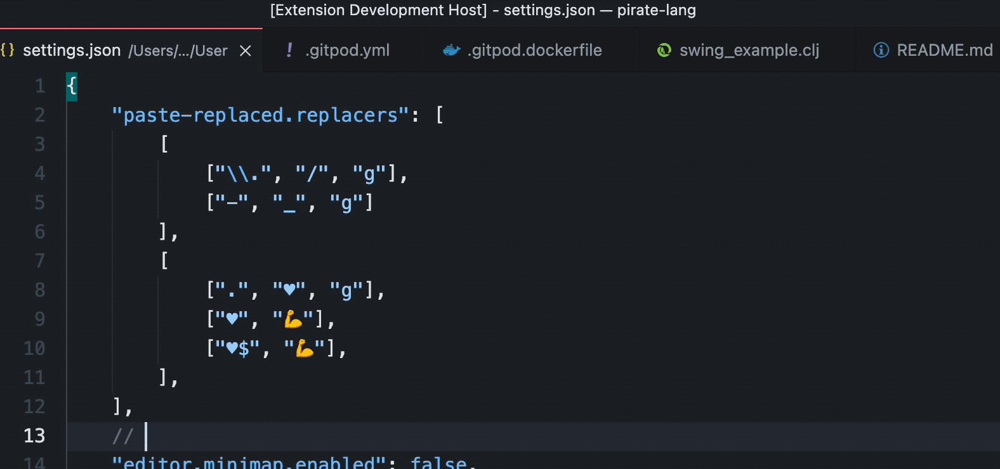

# Paste Replaced


## Features

Pastes the text from the Clipboard replaced with regular expressions that you configure.

Default keyboard shortcut: <kbd>Ctrl</kbd>+<kbd>Alt</kbd>, <kbd>V</kbd>

But first you need to configure `paste-replaced.replacers`. Please read on.

## An example

With these settings:

```json
    "paste-replaced.replacers": [
        [
            [".", "♥️", "g"],
            ["♥️", "💪"],    
            ["♥️$", "💪"],
        ],
        [
            ["\\.", "/", "g"],
            ["-", "_", "i"]    
        ],
    ],
```

And you have the this text copied:

```
I love you!
```

Then if you **Paste Replaced** <kbd>Ctrl</kbd>+<kbd>Alt</kbd>, <kbd>V</kbd>, you will paste:

```
💪♥️♥️♥️♥️♥️♥️♥️♥️♥️💪
```

## How it works

Paste Replace will read the first array of `[search, replace, flags?]` tuples in the `paste-replaced.replacers` array. (Yes, the settings is an array of arrays of tuples.) This we call a `Replacer`. In the example that is:

```json
        [
            [".", "♥️", "g"],
            ["♥️", "💪"],    
            ["♥️$", "💪"],
        ],
```

Then each tuple of `[search, replace, flags?]` will be applied in the order they appear in the `Replacer` array. ”Apply” here means that internally the JavaScript method `String.replace()` will be called on the text, something like so:

```javascript
newText = text.replace(new RegExp(search, flags), replace)
```

For each `[search, replace, flags?]` tuple. So for the example:

1. Replace any and all (that `"g"` flag) character with "♥️"
1. Replace the first occurrence of a "♥️" with a "💪"
1. Replace any "♥️" at the end of the text with a "💪"

## Another example

With these settings:

```json
    "paste-replaced.replacers": [
        [
            ["\\.", "/", "g"],
            ["-", "_", "g"]    
        ],
        [
            [".", "♥️", "g"],
            ["♥️", "💪"],    
            ["♥️$", "💪"],
        ],
    ],
```

And you have this text selected:

```clojure
pez.sandbox-labs.sicp.heron-sqrt
```

Then: **Paste Replace** <kbd>Ctrl</kbd>+<kbd>Alt</kbd>, <kbd>V</kbd> will give you:

```
pez/sandbox_labs/sicp/heron_sqrt
```

This particular example is converting a Clojure namespace to a file path segment matching the file defining the namespace. So if you have a Clojure project and a Clojure namespace you can quickly open the file like so:



## Yet another example

Last one, promise!

Say you want to be able to write ”bare” url fragments in Markdown documents and easily convert them to proper links with `https://` prepended to the url part. Easy peasy!

```json
    "paste-replaced.replacers": [
        [ // hostname/path -> Markdown url
            [".*", "[$&](https://$&)"],
        ],
        [ // Clojure namespace -> file path segment
            ["\\.", "/", "g"],
            ["-", "_", "g"],
        ],
        ...
    ]
```


## Why an array of arrays of tuples?

You might have guessed it already. Since the extension only uses the first one you can use the rest of the array as a repository of nifty `Replacers`.

## It's Node.js Regexes

You can go quite fancy with how you want things to be replaced. Most things you read on a page like this works:

* https://developer.mozilla.org/en-US/docs/Web/JavaScript/Reference/Global_Objects/RegExp

## Licence

MIT

Free to use, modify and redistribute as you wish. 🍻🗽

## Sponsor my open source work ♥️

That, said, you are welcome to show me you like my work using this link:

* https://github.com/sponsors/PEZ 