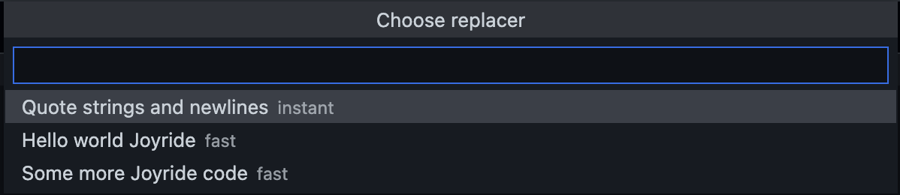

# Paste Replaced

Wield regular expressions on your Clipboard


Paste Clipboard or selections with configurable edits/replacements. And simulate typing, if you want. Works in editor documents as well as in all VS Code input boxes.

[Paste Replace on the VS Code Marketplace](https://marketplace.visualstudio.com/items?itemName=betterthantomorrow.paste-replaced)

## Some use cases

* Automatically quote strings and newlines when pasting into strings (e.g. JSON).
* Copy package/namespace strings and paste as paths in the 
* Spiff up your presentations by quickly inserting canned text anywhere in VS Code.

## Demo GIF

Here I cut out some code and Paste Replace it in the `settings.json`. Then I use that setting to paste the code back again into the document. Then I paste it into the [Joyride](https://marketplace.visualstudio.com/items?itemName=betterthantomorrow.joyride) **Run Clojure Code** input box and run it.


See the examples below for how this was configured.

## Features

* Configure **replacers** as a series of regular expressions
* Pastes the text from the Clipboard replaced with configured regular expressions.
   * Default keyboard shortcut: <kbd>Ctrl</kbd>+<kbd>Alt</kbd>+<kbd>V</kbd>, <kbd>SPACE</kbd>
   * Works in documents as well as in all VS Code input boxes
* Paste the selection replaced (overwriting it) 
* Configure typing simulation globally: instant (no simulation), fast, intermediate or slow
* Override global typing simulation with simulation configured per **replacer**
* Skip pasting to just place the replaced text on the clipboard

The uses cases for pasting replaced might be very different. The one that made me write this extension was to be able to fuzzy search for files, with a path that isn't in the format that VS Code's fuzzy search expects it. So I configured replacement from `.` to `/`, and from `-` to `_`, in that case.

The use case for the ”fast-typing” could probably be something else than quickly inserting canned text, even if that was the reason for adding the feature. (MacOS built-in text-substitution does not work in VS Code, for some reason.) You might wonder why I don't just use custom Snippets? That's because those don't work outside the edited files. I needed something that works in other input fields as well.

## How to Paste Replaced

You can use the **Paste Replaced: Paste..** menu, and/or you can configure keyboard shortcuts. 

To  populate the menu you need to configure `paste-replaced.replacers`. To use replacers from keyboard shortcuts, you bind keys to the `paste-replaced.paste` command provding a replacer. In both cases the replacers look like so:

Setting | Type | Description
--- | --- | ---
`name` | `string` | Used in the **Paste Replaced: Paste...** menu and when referencing the replacer in a keyboard shortcut.
`replacements` | `array` of tuples:<br>  `[search, replace_with, flags?]` | The tuples will be compiled to regular expressions, and applied to the text in the order they appear in the array.
`simulateTypingSpeed` | `enum`:<br> `"instant"`, `"fast"`, `"intermediate"`, `"slow"` | If set to `"instant"`, no typing simulation will be applied, otherwise simulate typing of configured speed.
`skipPaste`| `boolean` | If set to `true`, the replaced text will stay on the clipboard and not be pasted.

The `replacements` tuples are used something like so:

``` javascript
newText = text.replace(new RegExp(search, flags), replace_with)
```

(I've switched the order of the arguments, because it makes more sense to me, and because the flags are optional.)

**NB**: Watch for terminology used above. A **replacer** is an entry in the **Paste Replace: Paste...** menu, or provided as the argument to the `paste-replaced.paste` command in keyboard shortcuts. A **replacer** has **replacements**, that array of regex tuples.

### Keyboard shortcuts replacers

A keyboard shortcut replacer (args to `paste-replaced.paste`) can also be a string. In this case it will be referring to replacer configured in settings. See examples below.

## A Paste Clipboard Replaced Example

Say you need to configure code snippets in JSON. Just pasting the code leaves you with the task of quoting double quotes, potentially trimming strings of whitespace, and removing new lines.

### Via keybindings

Here's a keyboard shortcut configuration that will do all that:

```json
    {
        "command": "paste-replaced.paste",
        "key": "ctrl+alt+v q",
        "args": {
            // "name" if not strictly needed
            "name": "Quote strings and newlines",
            "replacements": [
                [ "\"", "\\\"", "g" ],
                [ " +", " ", "g" ],
                [ "\n", "\\n", "g" ],
            ]
        },
    }
``` 

Then if you have this text on the clipboard:

```js
console.log(
    "Hello World!"
    );
```

Then place the cursor in an empty string (`""`), and do <kbd>Ctrl</kbd>+<kbd>Alt</kbd>+<kbd>V</kbd> <kbd>Q</kbd>, you'll get:

```js
"console.log(\n \"Hello World!\"\n );"
```

Which is much more JSON friendly. (You might want to leave strings of spaces, then skip the `[ " +", " ", "g" ]` replacer.)

### Via `settings.json`

You can also configure the replacer as a `paste-replaced.replacers` configuration:

``` json
    "paste-replaced.replacers": [
        {
            "name": "Quote strings and newlines",
            "replacements": [
                [ "\"", "\\\"", "g" ],
                [ " +", " ", "g" ],
                [ "\n", "\\n", "g" ],
            ]
        },
        ...
    ],
```

That will give you the **Paste Replaced: Paste...** menu option *Quote strings and newlines*.

### Both settings and keybinding

You can make shortcuts referencing replacers configured in settings.json, to keep things a bit DRY:

```json
    {
        "command": "paste-replaced.paste",
        "key": "ctrl+alt+v q",
        "args": "Quote strings and newlines",
    }
``` 

Now the same replacer can be used both from the menu and via the keyboard shortcut.

## A Canned Text Example

During a [Joyride](https://marketplace.visualstudio.com/items?itemName=betterthantomorrow.joyride) (a scripting extension for VS Code) demo. I wanted to be able to type a ”Hello World” snippet quickly:

```clojure
(vscode/window.showInformationMessage "Hello World!")
```

And also a slighly more involved snippet:

```clojure
(p/let [choice (vscode/window.showInformationMessage "Be a Joyrider 🎸" "Yes" "Of course!")]
  (if choice
    (.appendLine (joyride/output-channel) (str "You choose: " choice " 🎉"))
    (.appendLine (joyride/output-channel) "You just closed it? 😭")))
```

This configuration defines the replacers:

```json
    "paste-replaced.replacers": [
        ...
        {
            "name": "Hello world Joyride",
            "replacements": "(vscode/window.showInformationMessage \"Hello World!\")",
            "simulateTypingSpeed": "fast"
        },
        {
            "name": "Some more Joyride code",
            "replacements": "(p/let [choice (vscode/window.showInformationMessage \"Be a Joyrider 🎸\" \"Yes\" \"Of course!\")]\n  (if choice\n    (.appendLine (joyride/output-channel) (str \"You choose: \" choice \" 🎉\"))\n    (.appendLine (joyride/output-channel) \"You just closed it? 😭\")))",
            "simulateTypingSpeed": "fast"
        },
        ...
    ],
``` 

Here I've added the `"simulateTypingSpeed": "fast"` to the replacers to make it a bit more like I am typing the code fast. (And guess how I quoted and pasted that `replacements` code! 😀)

To use it I bring up the **Paste Replaced...** menu, <kbd>Ctrl</kbd>+<kbd>Alt</kbd>+<kbd>V</kbd> <kbd>SPACE</kbd>:



From there I can select which canned code to paste (type fast). This menu remembers what was selected last, so in the real demo I had many canned examples and could easily type next, and then next, and so on.

## It's Node.js Regexes

You can go quite fancy with how you want things to be replaced. Most things you read on a page like this works:

* https://developer.mozilla.org/en-US/docs/Web/JavaScript/Reference/Global_Objects/RegExp

## License

MIT

Free to use, modify and redistribute as you wish. 🍻🗽

## Sponsor my open source work ♥️

That, said, you are welcome to show me you like my work using this link:

* https://github.com/sponsors/PEZ 
