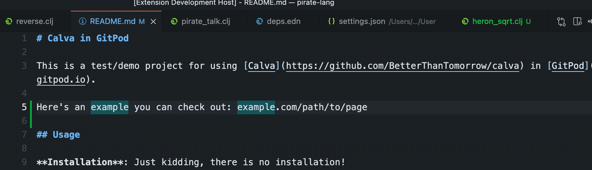

# Paste Replaced


## Features

* Pastes the text from the Clipboard replaced with configurable regular expressions.
   * Default keyboard shortcut: <kbd>Ctrl</kbd>+<kbd>Alt</kbd>+<kbd>V</kbd>, <kbd>V</kbd>
* ”Fast-typing” command(s) for inserting canned text, like `_hw` with some text, e.g. `console.log("Hello World!")`.
   * Default keyboard shortcut: <kbd>Ctrl</kbd>+<kbd>Alt</kbd>+<kbd>V</kbd>, <kbd>Ctrl</kbd>+<kbd>Alt</kbd>+<kbd>V</kbd>
   * The fast-typing can be made to simulate the text being typed in, at three levels of speed

Both features uses the same replacement configuration. And both features work when editing files *as well as in the various input prompts/fields in VS Code or from any extension*. (However, in the terminal, only the _paste clipboard content replaced_ works.)

The uses cases for pasting replaced might be very different. The one that made me write this extension was to be able to fuzzy search for files, with a path that isn't in the format that VS Code's fuzzy search expects it. So I configured replacement from `.` to `/`, and from `-` to `_`, in that case.

The use case for the ”fast-typing” could probably be something else than quickly inserting canned text, but again, that was the reason for adding the feature. (MacOS built-in text-substitution does not work in VS Code, for some reason.) You might wonder why I don't just use custom Snippets? That's because those don't work outside the edited files. I needed something that works in other input fields as well.

This Gif shows the _fast-typing_ feature. (Even if I am using the prototype I first made with the VS Code scripting extension [Joyride](https://marketplace.visualstudio.com/items?itemName=betterthantomorrow.joyride))


(If you're curious about Joyride and how this feature could be prototyped, see [this post, that explains it](https://clojureverse.org/t/say-hello-to-joyride-the-clojure-repl-in-vs-code/8957) somewhat.)

First you need to configure `paste-replaced.replacers`. Replacers are applied in the order they appear in the first replacers array. Each replacer is tuple of `[search, replace_with, flags?]`, which are passed to the JavaScript function used:

```javascript
newText = text.replace(new RegExp(search, flags), replace_with)
```

I've switched them because it makes more sense to me, and the flags are optional.

`paste-replaced.replacers` is configured as an array of arrays of replacer tuples. Only the first array or replacers is used. The others slots are there for you to use to store replacers for different use cases.

## A Paste Clipboard Replaced Example

Say you need to configure code snippets in JSON. Just pasting the code leaves you with the task of quoting double quotes, potentially trimming strings of whitespace, and removing new lines. Here's a configuration that will do all that when you paste:

```json
    "paste-replaced.replacers": [
        [
            [ "\"", "\\\"", "g" ],
            [ " +", " ", "g" ],
            [ "\n", "\\n", "g" ],
        ]
    ],
``` 

Then if you have this text on the clipboard:

```js
console.log(
    "Hello World!"
    );
```

And do <kbd>Paste Replace: Paste</kbd>, you'll get:

```js
console.log(\n \"Hello World!\"\n );
```

Which is much more JSON friendly. You might want to leave strings of spaces, then skip the `[ " +", " ", "g" ]` replacer.

## A ”Fast Typing” Example

I wanted to replace `_hw` with:

```clojure
(vscode/window.showInformationMessage "Hello World!")
```

And `_hw2` with

```clojure
(p/let [choice (vscode/window.showInformationMessage "Be a Joyrider 🎸" "Yes" "Of course!")]
  (if choice
    (.appendLine (joyride/output-channel) (str "You choose: " choice " 🎉"))
    (.appendLine (joyride/output-channel) "You just closed it? 😭")))
```

This configuration defines the replacers:

```json
    "paste-replaced.replacers": [
        [
            [
                "^_hw2$",
                "(p/let [choice (vscode/window.showInformationMessage \"Be a Joyrider 🎸\" \"Yes\" \"Of course!\")]\n (if choice\n (.appendLine (joyride/output-channel) (str \"You choose: \" choice \" 🎉\"))\n (.appendLine (joyride/output-channel) \"You just closed it? 😭\")))"
            ],
            [
                "^_hw$",
                "(vscode/window.showInformationMessage \"Hello World!\")"
            ],
        ]
    ],
``` 

(The reason `_hw2` is defined before `_hw` is that despite the anchoring, `_hw` would otherwise be replaced when using `_hw2`. I don't understand why. Might be a bug.)

Then in the code editor or in some input box I would type, say `_hw`, then press:  <kbd>Ctrl</kbd>+<kbd>Alt</kbd>+<kbd>V</kbd>, <kbd>Ctrl</kbd>+<kbd>Alt</kbd>+<kbd>V</kbd> (Hold down <kbd>Ctrl</kbd>+<kbd>Alt</kbd>, then press <kbd>V</kbd>, twice). The result is that `_hw` will be replaced by `(vscode/window.showInformationMessage "Hello World!")`. 


## Another Paste Clipboard Replaced Example

(This one is quite contrived...)

With these settings:

```js
    "paste-replaced.replacers": [
        [
            [".", "♥️", "g"],
            ["♥️", "💪"],    
            ["♥️$", "💪"],
        ],
        [
            ["\\.", "/", "g"],
            ["-", "_", "i"]    
        ],
    ],
```

And you have this text copied:

```
I love you!
```

Then if you **Paste Replaced: Paste** <kbd>Ctrl</kbd>+<kbd>Alt</kbd>+<kbd>V</kbd>, <kbd>V</kbd>, you will paste:

```
💪♥️♥️♥️♥️♥️♥️♥️♥️♥️💪
```

## Yet another Paste Clipboard Replaced Example

With these settings:

```js
    "paste-replaced.replacers": [
        [
            ["\\.", "/", "g"],
            ["-", "_", "g"]    
        ],
        [
            [".", "♥️", "g"],
            ["♥️", "💪"],    
            ["♥️$", "💪"],
        ],
    ],
```

And you have this text selected:

```clojure
pez.sandbox-labs.sicp.heron-sqrt
```

Then: **Paste Replace: Pastee** will give you:

```
pez/sandbox_labs/sicp/heron_sqrt
```

This particular example is converting a Clojure namespace to a file path segment matching the file defining the namespace. So if you have a Clojure project and a Clojure namespace you can quickly open the file like so:


## Yet another example

Last one, promise!

Say you want to be able to write ”bare” url fragments in Markdown documents and easily convert them to proper links with `https://` prepended to the url part. Easy peasy!

```js
    "paste-replaced.replacers": [
        [ // hostname/path -> Markdown url
            [".*", "[$&](https://$&)"],
        ],
        [ // Clojure namespace -> file path segment
            ["\\.", "/", "g"],
            ["-", "_", "g"],
        ],
        ...
    ]
```



## Your examples

I've created a [gist for collecting examples](https://gist.github.com/PEZ/676706cdea7fdd24f23d92127fd2b3e2). Please consider adding your uses of this extension there!

## Why an array of arrays of tuples?

You might have guessed it already. Since the extension only uses the first one you can use the rest of the array as a repository of nifty `Replacers`.

## It's Node.js Regexes

You can go quite fancy with how you want things to be replaced. Most things you read on a page like this works:

* https://developer.mozilla.org/en-US/docs/Web/JavaScript/Reference/Global_Objects/RegExp

## Licence

MIT

Free to use, modify and redistribute as you wish. 🍻🗽

## Sponsor my open source work ♥️

That, said, you are welcome to show me you like my work using this link:

* https://github.com/sponsors/PEZ 